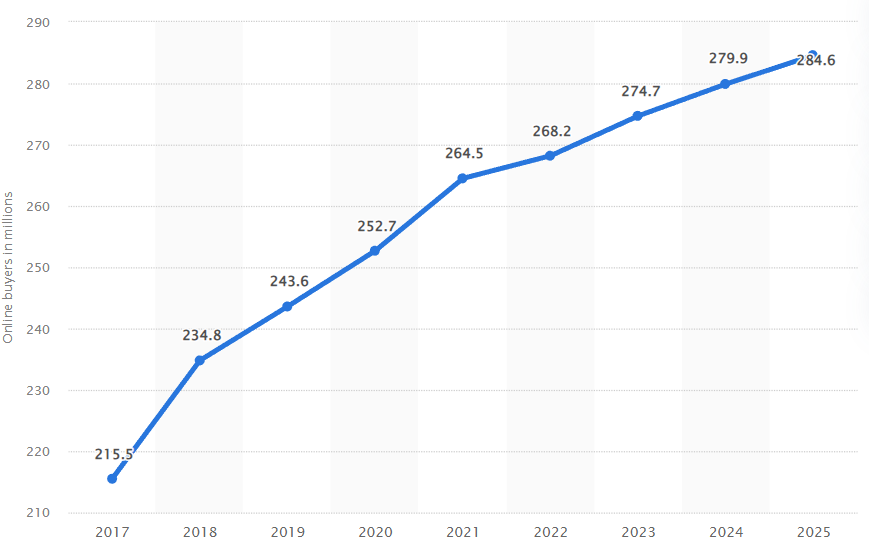
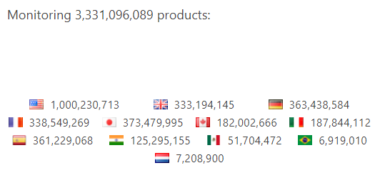

## Problem Statement and Solution

Many people in today's society have faced the issue of purchasing an item from a
certain online retailer, just to realize there exists a better deal at a
different retailer, one that they were not even aware of. This may seem
insignificant for one individual purchase, but considering the long term effect
of making numerous online purchases, you would realize this results in a
significant and unnecessary waste of money. In addition, trying to find the best
deal on an item can become quite time consuming and inconvenient.

A solution to these problems would be a price tracking chrome extension, called
PriceHawk. This extension would allow for the user to create a collection of
online listings, from a variety of retailers, for each individual product they
are interested in buying.

Even if a retailer does not have a product of interest, the user can still add
it to their collection of online listings. From there, when the item becomes
listed, the user will be notified of this. In addition, when the price of an
item changes for a particular retailer (ex. due to a sale, limited time
event/deal, etc.), the user will be notified of this, so they can take advantage
of the lower priced options.

In addition, the extension will notify the user when an item of interest is low
in stock for a particular retailer, so the user does not miss out.

PriceHawk would allow for the user to access their own portfolio in a separate
tab, where they can have access to a convenient interface that allows them to
browse through their collections of product listings. Each product would include
a pricing history graph, which showcases the changes in the market prices set by
the various retailers, shown over a selected period of time.

Overall, PriceHawk would save consumers both time and money when making online
purchases, and would add convenience to the busy lives of many.

## User Experience

Our UX will roughly follow this
[Figma sketch](https://www.figma.com/file/UkgZOcVDRwv47Z6Ad9kZib).

## Key Users

- A key user is someone who frequently shops online, and wants to save money
  while doing so.
- A key user is an online business owner who wants to be aware of the prices
  their competitors have for products they also sell.
- A key user is someone who is interested in market trends, and wants a
  convenient way to keep track of them in order to conduct research/analysis..

## Scenarios

Jeremy is looking to buy a prebuilt gaming PC. He doesn’t have much money to
spend and is looking to make sure he makes an economical purchase. He finds a
few computers online and is looking to track their price to see if any dip in
price. None of the popular price tracking websites support the smaller companies
he’s looking to purchase from, so after much trial and error he finds our
extension through the Chrome Web Store. He’s able to successfully track the
products using our extension, and after a few weeks of scanning prices he
notices one goes on sale and makes the purchase.

Bob is working on a personal project that looks at the latest trends in
clothing, in particular with regards to suits, and why they occur. He has found
many brands of suits which vary widely in their cost. He is looking for the
current price and any changes in prices that will occur along with the brands
that are lowering their costs or are offering a sale. He wishes to see if there
is a trend in the prices and to be able to find it if it exists. He finds our
extension through a Reddit thread discussing how to track products across the
web. He uses our extension to track the price of a list of suits. After a month
of using the extension he exports the data and runs a statistical analysis on
it.

Karen is looking to sell some new winter tires. There are many stores that offer
winter tires and she needs a competitive price to keep up with those stores. She
needs to see what her competitors are offering at what price in order to do so.
She also needs to take into account any sales that are ongoing or could start at
any moment so that she can plan her pricing strategy accordingly. She finds our
extension through Google and begins tracking her competitors tire pricing. When
the extension notifies her of a price change, she decides if she should match
the competitor's new price.

## Market Sizing Analysis and Business Potential

With an online price tracker the market sizing capabilities are within the
hundreds of millions of potential users as online shopping becomes more and more
popular in the modern world. Everyday more users are shopping online and more
businesses are opening online web stores or their entire business model revolves
around an online store. Just in the US alone it is estimated there were around
[268 million online shoppers in 2022](https://www.statista.com/statistics/273957/number-of-digital-buyers-in-the-united-states/), with that number projected to increase
in 2023. 

To target these average online shoppers to help them in their online
spending, the growth potential for the product certainly exists. As a business
of the product, the goal is to get a large number of users to incorporate the use
of pricehawk into their daily online shopping routines. Then there are a few avenues which we could take to become profitable, through selling a premium subscription based service with additional features and bonuses for the user. Also parenting with affiliated e-commerce sites, so when customers use pricehawk to buy items from such sites, we take a small commission of the purchase. To gain a healthy userbase that has the potential to grow, we could for instance go to as many online vendors as possible and offer them a cut of our users' subscription fees from all the users that tracked at least one item on their website. Since this advertising strategy assumes an existing chunk of subscribers, we would pay a one time advertising fee, on top of the previous offer, to allow these vendors to showcase our extension in order to get the ball rolling. Initially, our extension would be published on the chrome web store and would be marketed heavily towards the general consumer that wants to save money in their daily online shopping routines. Other forms of advertising could include Google ads and paid sponsorships to Youtubers.

[Keepa](https://keepa.com/#!), a price tracker only used for Amazon, currently has users monitoring around 1 billion products in the U.S alone. 

Keepa charges 19 € / month. They have 3m+ downloads on the chrome store. Their number of premium users are unknown. If we pessimistically assume only 500k of those downloads are active users (even though it's probably higher since they have 3.3 billion active products being monitored), and only 5% of those users are subscribers = 500k * 0.05 * 19 = 475k € / month! And that is for Amazon alone. The potential revenue for tracking prices from multiple online vendors would be enormous. Realistically, since Keepa already dominates Amazon, it would be hard to take away the market share from them. However, it wouldn't be impossible to take away even a small fraction from them (which would still be significant in terms of user activity) by offering lower monthly fees for premium members. Nonetheless, we wouldn't need to take Keepa's Amazon market share since there are an endless amount of online venders that our extension could be used on.

## Principles

First is efficiency in keeping track of everything. The prices should be
displayed accurately and promptly.

Second, if there are errors that can’t be solved internally, they should be
communicated to the user quickly along with steps to take regarding the error.

Third is the appearance. The overall appearance of the extension should look
attractive.

## Feasibility

For the most part, the requirements for this product are pretty standard. We’ll
create a typical Chrome extension which interacts with our backend REST API. The
ability to store and display price history is relatively simple, along with our
other features.

The uniquely difficult aspect will be to allow the scraping of any arbitrary
website for price data. We’ll do this by letting the user select a region of the
page where the price is, and then we store the DOM structure of that region. We
can then use that DOM structure to let the web scraper know where the price
information should be. Ad Blockers have a similar feature which lets users
select a region to be hidden.
https://www.ghacks.net/2017/02/21/ublock-origin-how-to-remove-any-element-from-a-page-permanently/
